Azure DevOps Pipelines Infrastructure Building Blocks Startup Kit

An Azure DevOps pipeline allows a list of repeatable tasks to be executed in an
Azure environment such as creating a virtual machine. There are many options
when considering automating Azure deployment using Azure DevOps pipelines
(<https://dev.azure.com>). The goal of this document is outline common scripting
language choices and provide detail in how to use them starting with the
simplest and working towards more complex structures. Examples will be provided
both as importable pipelines and step by step instructions to get you running
right away. One concept that will be highlighted is creating modular pipelines
that maximize code reuse from this github repo.

Before starting any automation project It’s important to understand the scope of
your automation. If your system will eventually be supported by another group,
you should also understand their skill level and support capability.

When considering scope some questions you may ask are whether you are automating
a complete Azure environment that includes networking, resource group, compute,
storage, and configuration/code OR you are only automating a subset of these
components.

Another important topic is understanding whether the scripting you plan to use
requires state fullness. This quality allows assessment of the current state to
determine if it is compliant and then executes the appropriate changes to bring
it into compliance. Without this state fullness quality, scripts will execute a
set of commands without assessment.

Below is a list of common Microsoft scripting languages used for infrastructure
activities (network, resource groups, VMs) in Azure DevOps pipelines and whether
they have state fullness:

| Microsoft script                       | State fullness |
|----------------------------------------|----------------|
| Powershell                             | No             |
| Azure Resource Manager (ARM) templates | Yes            |
| Powershell DSC                         | Yes            |

These scripting languages can be used in combinations to achieve the optimal
automation covering tasks such as modification/creation of Azure objects, VM
extensions, and guest VM configuration. Below is a list of common combinations:

| Microsoft script structure                                 | How they are used                                                                                                   |
|------------------------------------------------------------|---------------------------------------------------------------------------------------------------------------------|
| Powershell only                                            | Azure objects, VM extensions and guest VM config                                                                    |
| ARM templates                                              | Azure objects and VM extensions                                                                                     |
| ARM templates calling Powershell DSC                       | ARM for azure objects and VM extensions calling DSC for guest VM config                                             |
| ARM templates calling sub-ARM templates and Powershell DSC | ARM for azure objects and VM extensions calling DSC for guest VM config. Sub-ARM templates provide more modularity. |
| Powershell and Powershell DSC                              | Powershell for azure objects and VM extensions and DSC for guest VM config                                          |
| Combination                                                | Script language chosen for specific actions                                                                         |

If you add in third party scripting options, you have a long list of choices and
combinations. Understanding your available options will improve your pipeline
design for specific situations.

Let’s start with a discussion of the simplest which is Powershell only. More
complex structures will be detailed in additional sections.

Azure Deployment with Azure DevOps – Powershell Only
----------------------------------------------------

Powershell provides a simple stateless method to deploy automation from Azure
DevOps.

As an example of how to use Powershell in Azure Pipelines we’ll create a VM. To
follow this example, you will need the following available:

-   **Azure subscription**

    -   **Azure resource group**

    -   **Azure virtual network and subnet**

-   **Azure DevOps account**

    -   **Azure DevOps project**

        -   Created in the azure DevOps account

    -   **Azure DevOps service connection to your Azure subscription**

        -   If you need to set one up see
            <https://docs.microsoft.com/en-us/azure/devops/pipelines/library/service-endpoints?view=vsts>

If you would like to try the example, start by signing in to your Azure DevOps
account (<https://dev.azure.com>), and choose a project to work in.

This example will use a build pipeline instead of a release pipeline for
simplicity and will also rely on several pipeline variables that will need to be
setup.

For this example, you can either build a new one using this step-by-step guide
or import a pipeline from the [github
repository](https://github.com/jriekse5555/InfrastructureAsCode-Powershell).

### To import the example build pipeline:

-   Download the example import file from the github repo
    ‘ExampleBuildPipeline-DeployVMwithPowershell.json’

-   Create a new build pipeline (the import option is not available without at
    least one present)

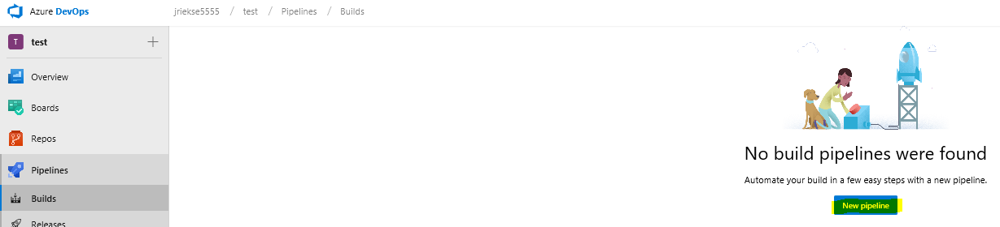

-   Choosing default is fine

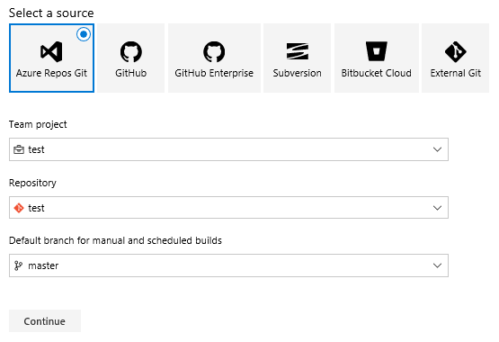

-   Then…

-   When it creates Save it

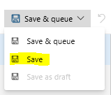

-   Then go back to the Builds icon on the left, click it, then the New
    drop-down, and choose import

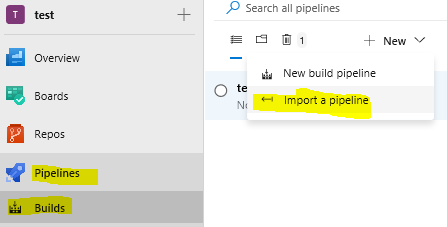

-   Browse to the previously downloaded pipeline

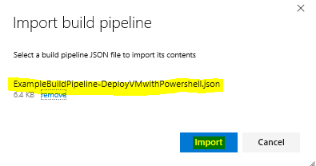

-   For the agent pool choose Hosted VS2017

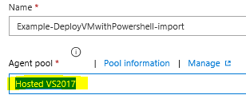

-   For each task choose your service connection

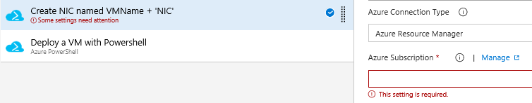

-   Save the build pipeline

-   **Done, with the exception of creating the pipeline or group variables that
    the scripts depend on!**

### To build the example build pipeline from scratch instead of importing:

-   See the steps in the previous section for how to build a blank build
    pipeline

-   After naming it, it should look like:

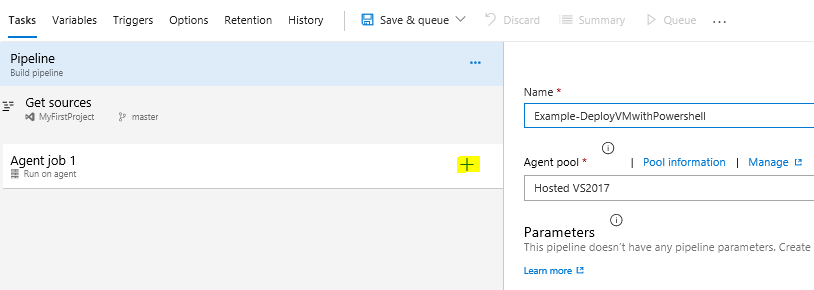

-   Click the + sign highlighted above to create a new task.

-   Azure DevOps has many built-in task templates. Click Add for the one below
    to deploy powershell to Azure.

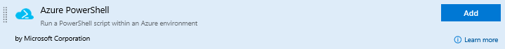

-   It will be added to your pipeline as shown below. Highlight the step to
    choose options for it.

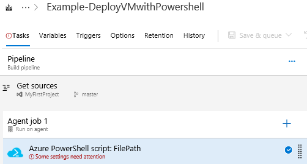

-   The default task is shown below which allows connecting to Azure through an
    Azure service connection, executing a powershell script (inline or
    referenced script), choosing a powershell version, and other options.

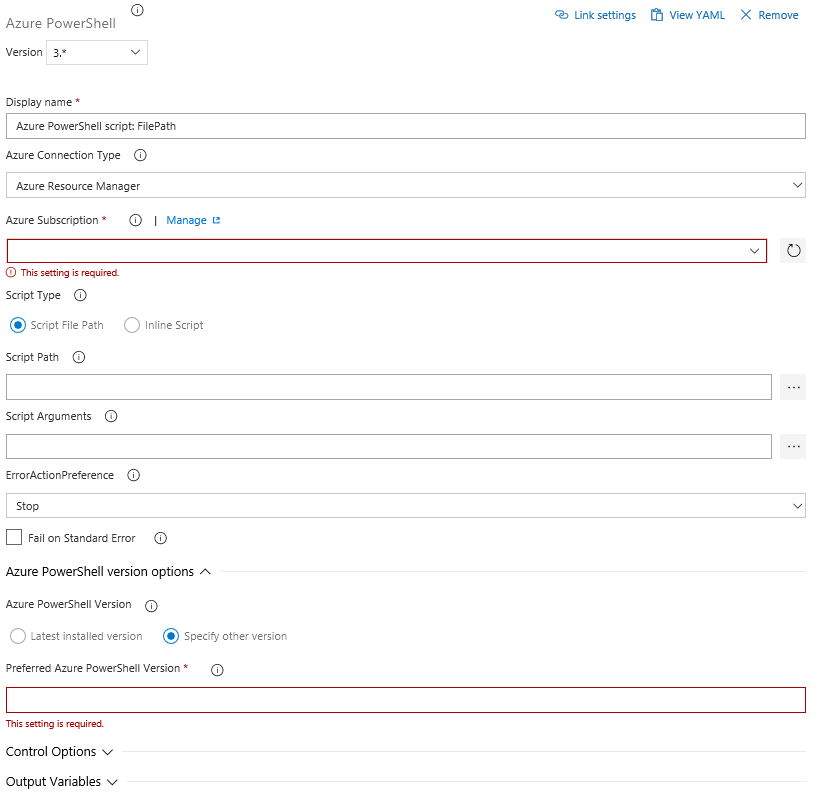

-   To create a VM we’ll use two tasks. The first will setup the virtual network
    interface card (NIC) and the second will create the virtual machine (VM).
    Since Azure pipelines allow multiple steps having separate steps for the NIC
    creation and VM creation allows additional customization to be added to a
    specific pipeline such as adding a public IP to the NIC configuration.

-   For this task menu, setup the task as shown in the picture below which will
    require inputting:

    -   Name (ex. Create NIC named VMName + 'NIC')

    -   Service Connection (your service connection)

    -   Inline Powershell script shown below (click Inline button first)

*\# Creates variable for NIC name using DevOps variable for VMName with 'NIC'
suffix*  
*\$NICName = "\$(VMName)" + "NIC"*

*\# Creates variable for the Azure subnet object using several DevOps variables*  
*\$SubnetObject = "/subscriptions/" + "\$(SubscriptionID)" + "/resourceGroups/"
+ "\$(NetworkRG)" + "/providers/Microsoft.Network/virtualNetworks/" +
"\$(Network)" + "/subnets/" + "\$(Subnet)"*

*\# Creates NIC using previous variables and DevOps variables*

*\$NIC = New-AzureRmNetworkInterface -Name \$NICName -ResourceGroupName
"\$(ResourceGroup)" -Location "\$(Location)" -SubnetId \$SubnetObject -Force*

-   ‘Latest…’ button for Powershell version

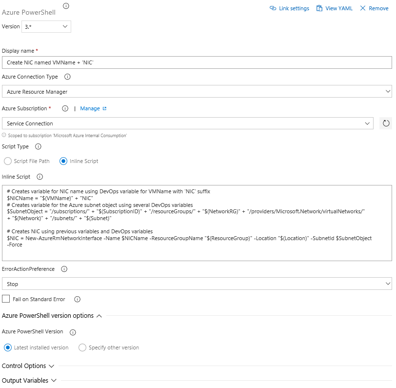

-   Click the ‘Save’ button along the ribbon to save your work:

-   Next, we’ll add the 2nd powershell script to create a VM.

-   Click on our previous powershell script and then right-click choosing Clone
    task(s) (shown below)

-   For this 2nd powershell script change the step as shown in the picture
    below. The two items that need to be changed are:

    -   Name (ex. Create NIC named VMName + 'NIC')

    -   Inline Powershell script shown below

*\$localPass = ConvertTo-SecureString "\$(localPass)" -AsPlainText -Force*  
*\$NICName = "\$(VMName)" + "NIC"*

*\$NIC = Get-AzureRmNetworkInterface -ResourceGroupName "\$(ResourceGroup)"
-Name \$NICName*

*\$Credential = New-Object System.Management.Automation.PSCredential
("\$(localUser)", \$localPass)*

*\$VirtualMachine = New-AzureRmVMConfig -VMName "\$(VMName)" -VMSize
"\$(VMSize)"*  
*\$VirtualMachine = Set-AzureRmVMOperatingSystem -VM \$VirtualMachine -Windows
-ComputerName "\$(VMName)" -Credential \$Credential -ProvisionVMAgent
-EnableAutoUpdate*  
*\$VirtualMachine = Add-AzureRmVMNetworkInterface -VM \$VirtualMachine -Id
\$NIC.Id*  
*\$VirtualMachine = Set-AzureRmVMSourceImage -VM \$VirtualMachine -PublisherName
'MicrosoftWindowsServer' -Offer 'WindowsServer' -Skus '2016-Datacenter' -Version
'latest'*  
*\$VirtualMachine = Set-AzureRmVMOSDisk -VM \$VirtualMachine -CreateOption
'FromImage' -StorageAccountType 'Standard_LRS' -Name "\$(VMName)-osdisk"*  
*\$VirtualMachine = Add-AzureRmVMDataDisk -VM \$VirtualMachine -Lun 0
-CreateOption 'Empty' -Name "\$(VMName)-datadisk1" -StorageAccountType
'Standard_LRS' -Caching None -DiskSizeinGB 127*  
*\$VirtualMachine = Set-AzureRmVMBootDiagnostics -VM \$VirtualMachine -Disable*

*New-AzureRmVM -ResourceGroupName "\$(ResourceGroup)" -Location "\$(Location)"
-VM \$VirtualMachine -Verbose*

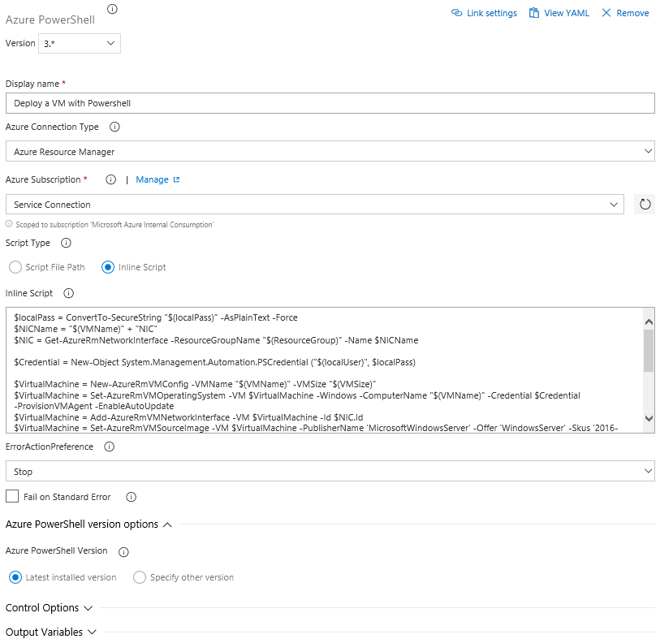

\- Click the ‘Save’ button along the ribbon to save your work:

### Setup the DevOps variables (needed for either imported or created build pipeline)

The following pipeline variables will need to be setup using the Variables tab
as Pipeline variables (highlighted below) or in a global Variables group which
is in the Library section:

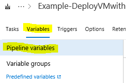

Pipeline variables (or variables in Variable groups) needed for powershell
script to work correctly:

| Description of Variable                                          | Variable Name  | Example                                     |
|------------------------------------------------------------------|----------------|---------------------------------------------|
| Virtual machine name used for Azure VM and guest computer name   | VMName         | myVM                                        |
| Subscription ID (found in Subscriptions section of Azure portal) | SubscriptionID | \<subscription ID\>                         |
| Virtual Network Resource Group                                   | NetworkRG      | myRG                                        |
| Virtual Network Name                                             | Network        | myVNET                                      |
| Subnet Name (Subnet name within VNET)                            | Subnet         | Subnet1                                     |
| Resource Group Name that VM will be created in                   | ResourceGroup  | myRG                                        |
| Location Name of VM                                              | Location       | EastUS                                      |
| Password of local user                                           | localPass      | \<complex password at least 12 characters\> |
| Local user name                                                  | localUser      | localuser                                   |
| Size of the VM                                                   | VMSize         | Standard_A2_v2                              |

-   Remember to save your variables using the Save button

Your pipeline is finished! The final step is to click ‘Save and Queue’ along the
ribbon to deploy to your Azure environment.

The blue link top will show you the current status. This same link is available
via the Summary tab along the ribbon and you should also get an email with
status and this same link if an email account is configured on your Azure DevOps
account.

Also note all your changes are versioned and available via the History tab along
the ribbon. It allows you to compare differences and revert to previous
versions.

**The github repository path**
<https://github.com/jriekse5555/InfrastructureAsCode-Powershell> **has content
that may be useful for infrastructure Azure DevOps pipelines.**

### Quick guidance on navigating in Azure DevOps

Note: if you ever get lost you can use the following steps to relocate your
build pipeline tasks section:

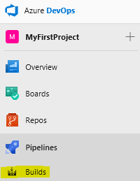

The folder icon has all the pipelines. The first icon only has favorite
pipelines.

Click on your build pipeline

In the right top corner, click Edit

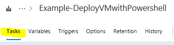
