# Azure DevOps Pipelines Infrastructure Building Blocks Startup Kit

An Azure DevOps pipeline allows a list of repeatable tasks to be executed in an
Azure environment such as creating a virtual machine. There are many options
when considering automating Azure deployment using Azure DevOps pipelines
(<https://dev.azure.com>). The goal of this document is outline common scripting
language choices and provide detail in how to use them starting with the
simplest and working towards more complex structures. Examples will be provided
both as importable pipelines and step by step instructions to get you running
right away. One concept that will be highlighted is creating modular pipelines
that maximize code reuse from an associated github repo.

Before starting any automation project It’s important to understand the scope of
your automation. If your system will eventually be supported by another group,
you should also understand their skill level and support capability.

When considering scope some questions you may ask are whether you are automating
a complete Azure environment that includes networking, resource group, compute,
storage, and configuration/code OR you are only automating a subset of these
components.

Another important topic is understanding whether the scripting you plan to use
will use either imperative or declarative syntax as described in detail
[here](https://www.powershellmagazine.com/2013/07/05/imperative-versus-declarative-syntax-in-powershell/).
In summary, imperative syntax lists specifically how a task will be completed
AND declarative allows assessment of the current state to determine if it is
compliant and then executes the appropriate changes to bring it into compliance.
Using imperative syntax scripts will execute a set of commands without
assessment.

Below is a list of common Microsoft scripting languages used for infrastructure
activities (network, resource groups, VMs) in Azure DevOps pipelines and the
syntax type used:

| Microsoft script                       | Syntax Type |
|----------------------------------------|-------------|
| Powershell                             | Imperative  |
| Azure Resource Manager (ARM) templates | Declarative |
| Powershell DSC                         | Declarative |

These scripting languages can be used in combinations to achieve the optimal
automation covering tasks such as modification/creation of Azure objects, VM
extensions, and guest VM configuration. Below is a list of common combinations:

| Microsoft script structure                                 | How they are used                                                                                                   |
|------------------------------------------------------------|---------------------------------------------------------------------------------------------------------------------|
| Powershell only                                            | Azure objects, VM extensions and guest VM config                                                                    |
| ARM templates                                              | Azure objects and VM extensions                                                                                     |
| ARM templates calling Powershell DSC                       | ARM for azure objects and VM extensions calling DSC for guest VM config                                             |
| ARM templates calling sub-ARM templates and Powershell DSC | ARM for azure objects and VM extensions calling DSC for guest VM config. Sub-ARM templates provide more modularity. |
| Powershell and Powershell DSC                              | Powershell for azure objects and VM extensions and DSC for guest VM config                                          |
| Combination                                                | Script language chosen for specific actions                                                                         |

If you add in third party scripting options, you have a long list of choices and
combinations. Understanding your available options will improve your pipeline
design for specific situations.

Let’s start with a discussion of the simplest which is Powershell only. More
complex structures will be detailed in additional sections.

Example 1: Azure Deployment with Azure DevOps – Powershell Only
----------------------------------------------------

Powershell provides a simple imperative method to deploy automation from Azure
DevOps.

As an example of how to use Powershell in Azure Pipelines we’ll deploy a virtual
machine into Azure with an associated resource group and virtual network. To
follow this example, you will need the following available:

-   **Azure Subscription (http://portal.azure.com)**

    -   Permission will be required to create objects and create a service
        connection (if not already available)

-   **Azure DevOps account (http://dev.azure.com)**

If you don’t already have an Azure subscription, trial information can be found
here: <https://azure.microsoft.com/en-us/offers/ms-azr-0044p>.

If you don’t already have an Azure DevOps account, trial information can be
found here:  
<https://azure.microsoft.com/en-us/services/devops>

The example will be simpler if your Azure Subscription and Azure DevOps account
are registered under the same Microsoft account.

### Azure DevOps Example Instructions

#### Download GitHub repo

If you would like to try the example, first download the github content from
<https://github.com/jriekse5555/InfrastructureAsCode-Powershell> by using the
Clone or download button as shown below.

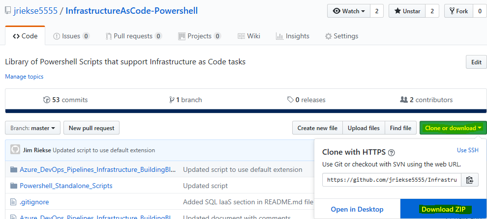

Once this is done unzip the resulting file. We’ll use this later.

#### Logon to Azure DevOps
Next, sign into to an Azure DevOps account (<https://dev.azure.com>). If you
don’t have one already there is a trial option using a Microsoft account such as
outlook.com.

#### Create an Azure DevOps Project
Next, you’ll need to create a project if don’t have one already.

-   If you want to create a new project, click the **Create Project** button on
    the right-side of the screen

-   Then name the project and click **Create**.

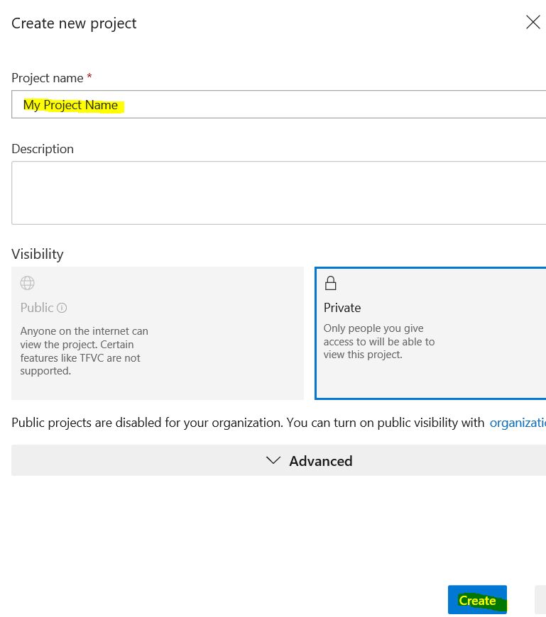

-   You should now be on the main page of your new project

#### Initialize Azure DevOps Repository  
Next, we’ll initialize the Repository to hold files

-   Click **Repos** on the left and then **Files**

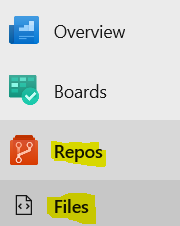

-   On the bottom of the right-pane click **Initialize**

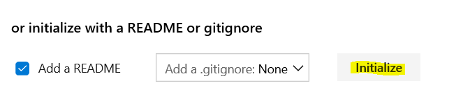

#### Create an Azure DevOps Release Pipeline

When working with Azure DevOps Pipelines the two primary types of pipelines are
build and release pipelines. Conceptually build pipelines are for
building/preparation activities such as compiling code or copying necessary
content from the DevOps repository to a storage account. Release pipelines are
for deploying or releasing content into the environment. Release pipelines
should be used for activities such as deploying code or virtual machines into
the environment. Release pipelines provide layered version control using a base
release pipeline and specific instantiations called releases.

For this example, you can either import a release pipeline from the associated
[github
repository](https://github.com/jriekse5555/InfrastructureAsCode-Powershell) OR
create a release pipeline step-by-step.

#### Create a blank release pipeline

Regardless of whether you are planning to import the release pipeline or create
one, you need to create a blank release pipeline first. The Azure DevOps portal
does not allow importing a release pipeline if none already exist and if you are
creating one from scratch this is the first step.

Within the Azure DevOps portal, click on **Pipelines**, then click **Releases**  

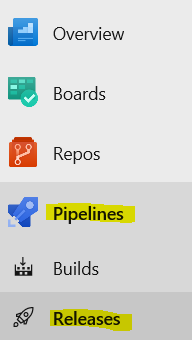

If this is the first release pipeline you’ve created click the **New Pipeline**
button on the right

If you’ve created a release pipeline previously in the middle-pane click the
**New** button and choose **New release pipeline**

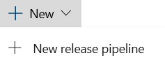

On the next screen choose the **Empty Pipeline** at the top of the choices

Close the option for changing the Stage Name with the X in the right-corner

Save the changes to your release pipeline with the Save button in the
right-corner

Next, choose whether you will import or create and follow only that section.

#### Scenario 1: Import the example release pipeline

With a blank release pipeline created and saved, navigate to the **Releases**
section

If you’ve created a release pipeline previously in the middle-pane click the
**New** button and choose **Import release pipeline**

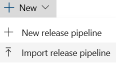

Browse to the location of the release pipeline to import. You should have
downloaded the github repository in the first example step. The proper release
pipeline is on the following path in this repo.

*InfrastructureAsCode-Powershell\\Azure_DevOps_Pipelines_Infrastructure_BuildingBlocks\\Import_AzureDevOpsPipelines\\Release_Pipelines\\Example_Deploy_VM_with_Powershell.json*

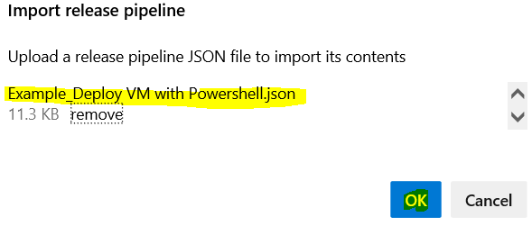

Click the **Tasks** button or the Stage 1 link

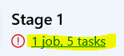

Click on the first step that needs attention

In the right-pane, note the agent that is used to run the release. You can
change this to use the hosted 2019 version.

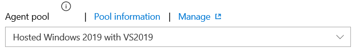

You cannot save the release pipeline until all errors have been resolved.

Next, click on any remaining task steps with errors. You may be missing a
service connection in each of the remaining steps. You may see the following in
the right-pane.

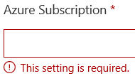

You will need a service connection between Azure DevOps and Azure. The service
connection is similar to a service account and provides the permission to alter
the Azure fabric from Azure DevOps.

If you already have a service connection available with appropriate permissions,
choose it.

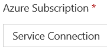

If you are using Azure DevOps for the first time and have not set a service
connection up previously, click the drop-down to determine if an Azure
subscription is listed. If a subscription is shown select it, then click the
button **Authorize** to allow the connection.

If an Azure subscription is not available or you want to use a different one,
click on the **Manage** link. Then choose the following:

Then

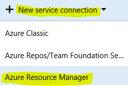

The basic service connection screen will appear. Next click the full version
link to enter the necessary details. Setting this up is beyond the scope of this
document. A service connection is required to continue with this example.

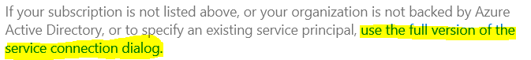

Resolve any remaining tasks steps and then Save the release pipeline.

Review the imported pipeline variables to ensure no changes are required to work
in your existing environment

The release pipeline should be complete.

Continue to the section **Test the release pipeline**. You can skip Scenario 2
which creates a release pipeline from scratch.

#### Scenario 2: Create the example release pipeline step-by-step

A blank release pipeline should be available based on the previous instructions.
If you don’t already have it open for editing, please navigate to it and click
Edit. Review the previous instructions if necessary.

Click on the name of your release pipeline and type in a new name of
**Example_Deploy_VM_with\_ Powershell**

Click on any white space on the page to set the new name

Next, set the variables that will be used throughout the pipeline. Click the
**Variables** button along the ribbon

Note that you are in the **Pipeline variables** section. This section is for
variables for this specific pipeline. For variable reuse across pipelines,
variable groups can be created in the **Library**.

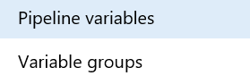

For this example, create the following Pipeline variables by typing them in:

| **Variable Name** | **Value**       |
|-------------------|-----------------|
| localPass         | P\@ssw0rd123456 |
| localUser         | localUser       |
| Location          | EastUS          |
| Network           | BuildingBlocks  |
| ResourceGroup     | BuildingBlocks  |
| Subnet            | Subnet1         |
| VMName            | BuildingBlocks  |
| VMSize            | Standard_B2s    |

The localPass variable can be locked to hide the value:

Change any variable values if required to accommodate your Azure environment.

This is a good time to save your work.

Click the **Tasks** button to start creating task steps.

Click on Agent job.

In the right-pane, note the agent that is used to run the release. You can
change this to use the hosted 2019 version.

Click the + sign on the right of Agent Job to create a task.

Type in **Azure Powershell** in the search box and click **Add** on the
resulting task.

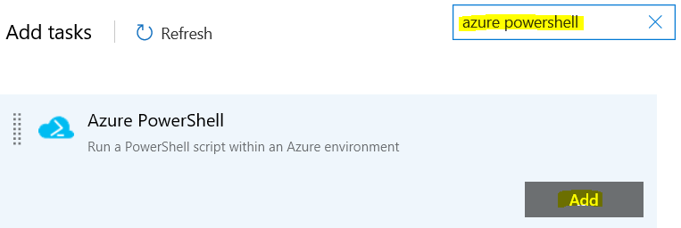

Click on the new task

In the right-pane, several settings will need to be set.

Change the **Display Name** to **Create Resource Group.** If you want to deploy
to an existing resource group, you could skip this step and set the variable
appropriately.

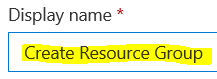

Next, you will choose or configure the service connection between Azure DevOps
and Azure. The service connection is similar to a service account and provides
the permission to alter the Azure fabric from Azure DevOps.

If you already have a service connection available with appropriate permissions,
choose it.

If you are using Azure DevOps for the first time and have not set a service
connection up previously, click the drop-down to determine if an Azure
subscription is listed. If a subscription is shown select it, then click the
button **Authorize** to allow the connection.

If an Azure subscription is not available or you want to use a different one,
click on the **Manage** link. Then choose the following:

Then

The basic service connection screen will appear. Next click the full version
link to enter the necessary details. Setting this up is beyond the scope of this
document. A service connection is required to continue with this example.

Returning to configuring the first task step, you should now have a service
connection set.

Choose the inline Powershell option.

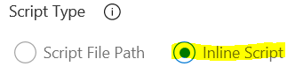

Paste in the Powershell content to create a Resource Group using the pipeline
variables.

*\#Note all variables with the syntax "\$()" are DevOps variables that need to
be predefined*

*\# Create Resource Group*  
*New-AzureRMResourceGroup -Name "\$(ResourceGroup)" -Location "\$(Location)"*

Choose the option to use the latest Powershell version.

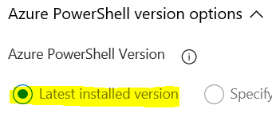

The first step is done. Save the pipeline

Right-click in the middle of the finished task step and choose **Clone
task(s)**.

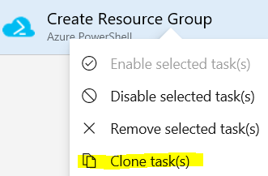

Click on the copied task step. Change the name to **Create Virtual Network and
Subnet**.

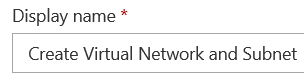

Paste in the Powershell content to create the virtual network and subnet using
the pipeline variables.

*\#Note all variables with the syntax "\$()" are DevOps variables that need to
be predefined*

*\# Create Virtual Network*  
*\$virtualNetwork = New-AzureRMVirtualNetwork \`*  
*-ResourceGroupName "\$(ResourceGroup)" \`*  
*-Location "\$(Location)" \`*  
*-Name "\$(Network)" \`*  
*-AddressPrefix 11.0.0.0/16*

*\#Create Subnet*  
*Add-AzureRMVirtualNetworkSubnetConfig \`*  
*-Name "Subnet1" \`*  
*-AddressPrefix 11.0.0.0/24 \`*  
*-VirtualNetwork \$virtualNetwork*

*\#Associate subnet with virtual network*  
*\$virtualNetwork \| Set-AzureRMVirtualNetwork*

This step is done. Save the pipeline

Right-click in the middle of the finished task step and choose **Clone
task(s)**.

Click on the copied task step. Change the name to **Create Virtual Network and
Subnet**.

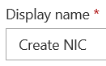

Paste in the Powershell content.

*\#Note all variables with the syntax "\$()" are DevOps variables that need to
be predefined*

*\# Creates variable for NIC name using DevOps variable for VMName with 'NIC'
suffix*  
*\$NICName = "\$(VMName)" + "NIC"*

*\# Gets Subnet ID for NIC creation*  
*\$vnet = Get-AzsureRMVirtualNetwork -Name "\$(Network)" -ResourceGroupName
"\$(ResourceGroup)"*  
*\$SubnetObject = \$vnet.Subnets[0].Id*

*\# Creates NIC using previous variables and DevOps variables*  
*\$NIC = New-AzureRmNetworkInterface -Name \$NICName -ResourceGroupName
"\$(ResourceGroup)" -Location "\$(Location)" -SubnetId \$SubnetObject -Force*

This step is done. Save the pipeline

Right-click in the middle of the finished task step and choose **Clone
task(s)**.

Click on the copied task step. Change the name to **Create Virtual Network and
Subnet**.

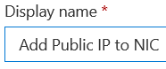

Paste in the Powershell content.

*\#Adds a public IP to a NIC*  
*\#Note all variables with the syntax "\$()" are DevOps variables that need to
be predefined*  
  
*\#Sets up Public IP object name*  
*\$PublicIPName = "Public-" + "\$(VMName)"*

*\#Creates Public IP object*  
*\$PublicIP = New-AzureRmPublicIpAddress -Name \$PublicIPName -ResourceGroupName
"\$(ResourceGroup)" -AllocationMethod Dynamic -Location "\$(Location)" -Force*

*\#Sets NIC Name that was created previously*  
*\$NICName = "\$(VMName)" + "NIC"*  
  
*\#Retrieves NIC object from name*  
*\$NIC = Get-AzureRmNetworkInterface -ResourceGroupName "\$(ResourceGroup)"
-Name \$NICName*

*\#Assign public IP object to NIC*  
*\$nic.IpConfigurations[0].PublicIpAddress = \$PublicIP*

*\#Updates NIC object*  
*\$NIC \| Set-AzureRmNetworkInterface*

This step is done. Save the pipeline

Right-click in the middle of the finished task step and choose **Clone
task(s)**.

Click on the copied task step. Change the name to **Create Virtual Network and
Subnet**.

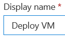

Paste in the Powershell content to create the virtual network and subnet using
the pipeline variables.

*\$localPass = ConvertTo-SecureString "\$(localPass)" -AsPlainText -Force*  
*\$NICName = "\$(VMName)" + "NIC"*

*\$NIC = Get-AzureRmNetworkInterface -ResourceGroupName "\$(ResourceGroup)"
-Name \$NICName*

*\$Credential = New-Object System.Management.Automation.PSCredential
("\$(localUser)", \$localPass)*

*\$VirtualMachine = New-AzureRmVMConfig -VMName "\$(VMName)" -VMSize
"\$(VMSize)"*  
*\$VirtualMachine = Set-AzureRmVMOperatingSystem -VM \$VirtualMachine -Windows
-ComputerName "\$(VMName)" -Credential \$Credential -ProvisionVMAgent
-EnableAutoUpdate*  
*\$VirtualMachine = Add-AzureRmVMNetworkInterface -VM \$VirtualMachine -Id
\$NIC.Id*  
*\$VirtualMachine = Set-AzureRmVMSourceImage -VM \$VirtualMachine -PublisherName
'MicrosoftWindowsServer' -Offer 'WindowsServer' -Skus '2016-Datacenter' -Version
'latest'*  
*\$VirtualMachine = Set-AzureRmVMOSDisk -VM \$VirtualMachine -CreateOption
'FromImage' -StorageAccountType 'Standard_LRS' -Name "\$(VMName)-osdisk"*  
*\$VirtualMachine = Add-AzureRmVMDataDisk -VM \$VirtualMachine -Lun 0
-CreateOption 'Empty' -Name "\$(VMName)-datadisk1" -StorageAccountType
'Standard_LRS' -Caching None -DiskSizeinGB 127*  
*\$VirtualMachine = Set-AzureRmVMBootDiagnostics -VM \$VirtualMachine -Disable*

*New-AzureRmVM -ResourceGroupName "\$(ResourceGroup)" -Location "\$(Location)"
-VM \$VirtualMachine -Verbose*

This step is done. Save the pipeline

#### Test the release pipeline

You should now have a completed release pipeline created by either import or
step-by-step.

A release pipeline can be deployed from several portal locations.

From the release pipeline edit view you can click the **Create a release**
button in the top-right corner.

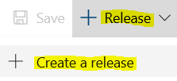

From the release pipeline overview…

Either way with result in a final screen, click the **Create** button

The deployment can be monitored within Azure DevOps.

Clicking the link after the release is created will show the status. Note that
the powershell commands in this example may generate errors upon multiple reruns
if objects like resource groups or virtual networks are already present. This
can be overcome by disabling steps that have already run or by other methods.

If you hover you the middle status widget you can select the **Logs** button.

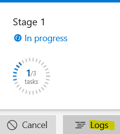

You should soon see a successful deployment and can verify the objects exist
within Azure.

If you navigate to the resource group holding the objects you should the
objects.

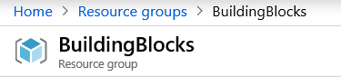

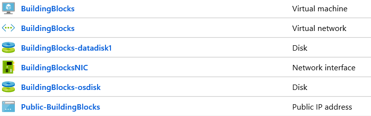

By clicking on the virtual machine, you can **Connect** to the virtual machine
via RDP using the local admin and password configured in the variables

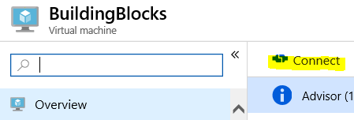

Click **Download RDP File**

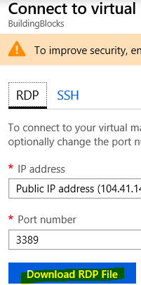

**Open** the RDP file

Click **Connect**

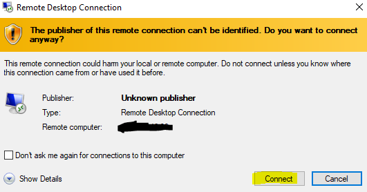

Type in the credentials from the variables. Click **OK**

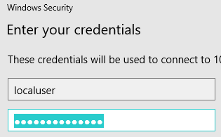

Click **Yes**

You should be successfully logged in.

Thanks for using the example. Feel free to send any feedback to
<jriekse5555@hotmail.com>.

If you are interested in customizing the example further the associated github
repository <https://github.com/jriekse5555/InfrastructureAsCode-Powershell> has
content that may be useful.

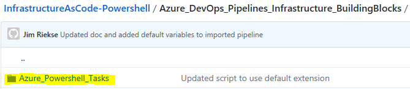

Example 2: Azure Deployment with Azure DevOps – Leveraging a Combination of Modular Techniques with a Release Pipeline (In Progress)
-------------------------------------------------------------------------------------------------------------------------

Moving on from the previous simple example, the next example will use several
more advanced declarative techniques executed serially by the pipeline. This
will continue to allow a high degree of customization using the simple graphical
pipeline interface and offer a higher degree of insurance that the desired state
is reached.

This example will also deploy a VM and will instead use individual ARM templates
for the NIC and virtual machine, and then Powershell DSC for configuration
inside the virtual machine. A release pipeline will be used.

Here is a graphic of the pipeline that will be constructed:

Example to be continued as soon as possible…

#### Appendix A: Marking pipelines as favorites

To assist with finding your pipelines quickly you may wish to mark them as
favorites.

The following steps show you how to mark your pipelines as favorites.

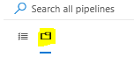

The folder icon has all the pipelines. The first icon only has recent pipelines.

Click on your pipeline and then mark it as a favorite.

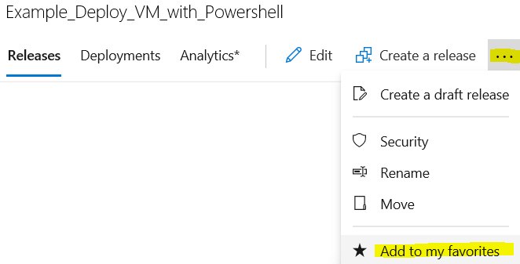
